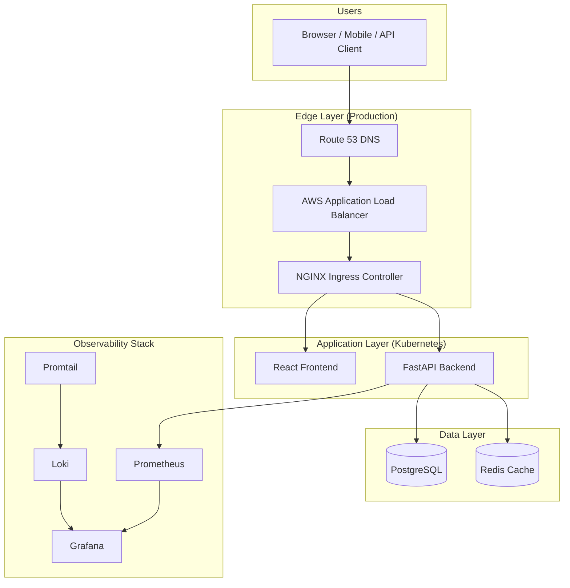
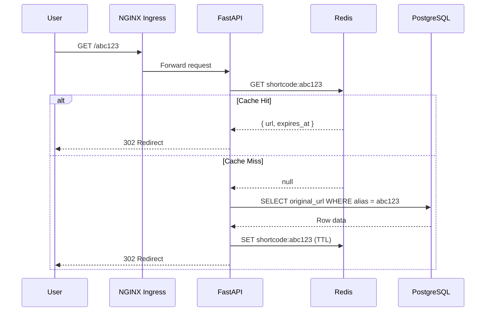
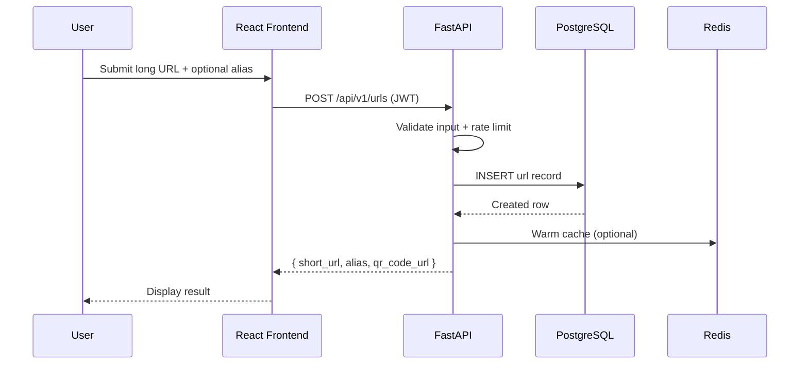
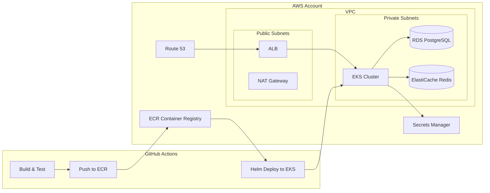
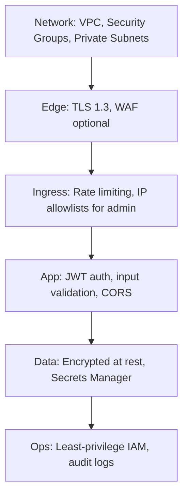

# Architecture

## Overview

LinkForge is a URL shortener designed to demonstrate production DevOps practices — not just a CRUD app with Docker slapped on top.

## High-Level System Architecture

## Request Flow — URL Redirect (Hot Path)

This is the most performance-critical path. In production, **99%+ of traffic** is redirects, not dashboard visits.

## Request Flow — Create Short URL (Authenticated)

## Deployment Topology (Target Production State)

## Component Responsibilities

| Component | Role | Why Separate |
|-----------|------|--------------|
| **React Frontend** | User dashboard, admin UI, auth flows | Decouples UI release cycle from API |
| **FastAPI Backend** | Business logic, auth, redirects, analytics | Stateless — scales horizontally in K8s |
| **PostgreSQL** | Source of truth for users, URLs, clicks | ACID transactions, relational queries |
| **Redis** | Cache hot redirects, rate limiting, sessions | Sub-millisecond reads for redirect path |
| **NGINX Ingress** | TLS termination, routing, rate limits | Industry standard K8s ingress |
| **Prometheus** | Metrics collection | Pull-based, K8s-native monitoring |
| **Grafana** | Dashboards and alerting UI | Unified observability view |
| **Loki + Promtail** | Log aggregation | Lightweight, label-based log indexing |
| **Terraform** | AWS infrastructure as code | Reproducible, reviewable infra changes |
| **Helm** | K8s package management | Templated, versioned deployments |
| **GitHub Actions** | CI/CD pipeline | Integrated with PR workflow |

## Security Layers

## Design Principles

1. **Stateless backend** — Any pod can handle any request. Enables horizontal scaling.
2. **Cache-first redirects** — Redis before PostgreSQL on the hot path.
3. **Infrastructure as Code** — Every AWS resource defined in Terraform.
4. **GitOps-ready** — All K8s config in Git, deployed via CI/CD.
5. **Observable by default** — Metrics, logs, and health checks from day one.
6. **Secure by default** — Secrets never in code; private subnets for data tier.

## Alternatives Considered

| Decision | Our Choice | Alternative | Why We Chose Ours |
|----------|-----------|-------------|-------------------|
| Backend framework | FastAPI | Django, Flask | Async-native, auto OpenAPI docs, modern Python |
| Database | PostgreSQL | MongoDB, DynamoDB | Relational model fits users ↔ URLs; RDS is battle-tested |
| Cache | Redis | Memcached | Data structures for rate limiting + TTL + pub/sub |
| Orchestration | Kubernetes (EKS) | ECS, plain EC2 | Industry demand, portable skills, Helm ecosystem |
| IaC | Terraform | CloudFormation, Pulumi | Multi-cloud, huge community, interview staple |
| CI/CD | GitHub Actions | Jenkins, GitLab CI | Native GitHub integration, zero infra to maintain |
| Ingress | NGINX Ingress | Traefik, ALB Ingress | Most common in production K8s clusters |

## Scalability Notes

| Bottleneck | Mitigation |
|------------|------------|
| Redirect latency | Redis cache, connection pooling, CDN for static assets |
| Database writes | Async click tracking (future: queue → batch insert) |
| API pods | HPA on CPU/request rate |
| Single-region failure | Multi-AZ RDS/ElastiCache (Phase 2+); multi-region is advanced |
